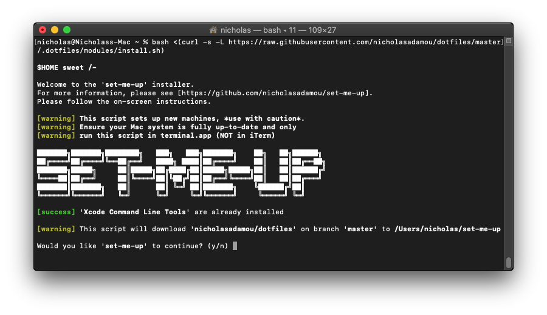

# `set-me-up` installer

[](https://github.com/dotbrains/set-me-up-installer/actions/workflows/tests.yml)
[](https://polyformproject.org/licenses/shield/1.0.0/)



This is the universal installer script used to install 'set-me-up' (smu) on a Mac, *debian*, *arch* based machine.

## Obtaining `set-me-up` installer

To start, your default shell must be set to `bash` prior to executing the `install` snippet for the first time. This is because on newer versions of Mac OS, the default shell is `zsh` instead of `bash`. To change your default shell, run the following command in your console.

```bash
sudo chsh -s $(which bash) $(whoami)
```

Once the default shell is `bash`, close and reopen the terminal window. Then, run the following command in your console.

(⚠️ **DO NOT** run the `install` snippet if you don't fully
understand [what it does](../install.sh). Seriously, **DON'T**!)

```bash
bash <(curl -s -L https://raw.githubusercontent.com/dotbrains/set-me-up-installer/main/install.sh)
```

You can change the `smu` home directory by setting an environment variable called `SMU_HOME_DIR`. Please keep the variable declared or else the `smu` scripts are unable to pickup the sources.

```bash
export SMU_HOME_DIR="some-path" \
    bash <(curl -s -L https://raw.githubusercontent.com/dotbrains/set-me-up-installer/main/install.sh)
```

## Discovering modules

`smu` resolves a module name like `productivity-tools/hyperkey` against the directory tree at `$SMU_HOME_DIR/dotfiles/modules/`, which is laid out by OS bucket:

```
$SMU_HOME_DIR/dotfiles/modules/
├── macos/        # MacOS-only modules
├── debian/       # Debian/Ubuntu-only modules
├── arch/         # Arch-only modules
└── universal/    # Modules that work on any supported OS
```

A module is any directory under one of those buckets that contains either a matching `<name>.sh` script or a `brewfile`. The path you pass to `-m` is the path relative to the bucket — for example, `modules/macos/productivity-tools/hyperkey/hyperkey.sh` is invoked as:

```bash
smu -p --no-base -m productivity-tools/hyperkey
```

The community-maintained module collections live in their own repositories — browse these to see what's available and to crib examples when authoring your own:

- [dotbrains/set-me-up-macos-modules](https://github.com/dotbrains/set-me-up-macos-modules)
- [dotbrains/set-me-up-debian-modules](https://github.com/dotbrains/set-me-up-debian-modules)
- [dotbrains/set-me-up-universal-modules](https://github.com/dotbrains/set-me-up-universal-modules)

### Listing what's installed locally

To see the modules currently available in your `$SMU_HOME_DIR`, use `-l` / `--list-modules`:

```bash
smu -l
```

Output is grouped by OS bucket. Each entry is tagged `[script]` or `[brewfile]` so you know what kind of module it is, and the name shown is the exact value you'd pass to `-m`:

```text
macos/
  productivity/hyperkey       [brewfile]
  terminal/alacritty          [script]

universal/
  python/pip                  [script]
  shell                       [brewfile]

Found 4 module(s) (showing 'macos' + 'universal'; use --all to include other OS buckets).
Run a module with: smu -p --no-base -m <module>
```

By default the list hides modules that don't apply to the current OS. Pass `--all` to include every bucket:

```bash
smu -l --all
```

To narrow the list, pass `--search <query>` (case-insensitive substring match against the module name):

```bash
smu -l --search hyper
smu -l --search python --all
```

### Interactive picker (fzf)

For a faster workflow, use `-i` / `--interactive` to launch an [`fzf`](https://github.com/junegunn/fzf)-powered multi-select picker. Type to fuzzy-filter, press **SPACE** (or **TAB**) to toggle a module, and press **ENTER** to provision everything you selected:

```bash
smu -i --no-base
```

`-i` honors the same filters as `-l`:

```bash
smu -i --search node          # pre-fill the fzf query with "node"
smu -i --all                  # include modules from other OS buckets
```

Selected modules are run through the same provisioning pipeline as `-p -m ...`, including the `-b` / `--no-base` flags. Requires `fzf` to be installed (`brew install fzf`, `apt install fzf`, or `pacman -S fzf`).

## Liability

The creator of this repo is _not responsible_ if your machine ends up in a state you are not happy with.

## Contributions

Yes please! This is a GitHub repo. I encourage anyone to contribute. 😃

## License

This project is licensed under the [PolyForm Shield License 1.0.0](https://polyformproject.org/licenses/shield/1.0.0/) -- see [LICENSE](LICENSE) for details.
